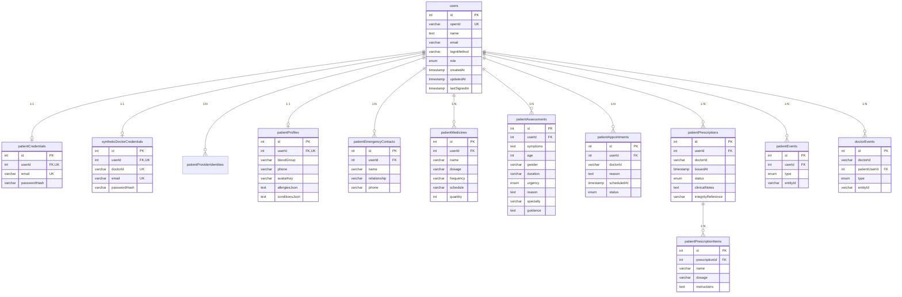
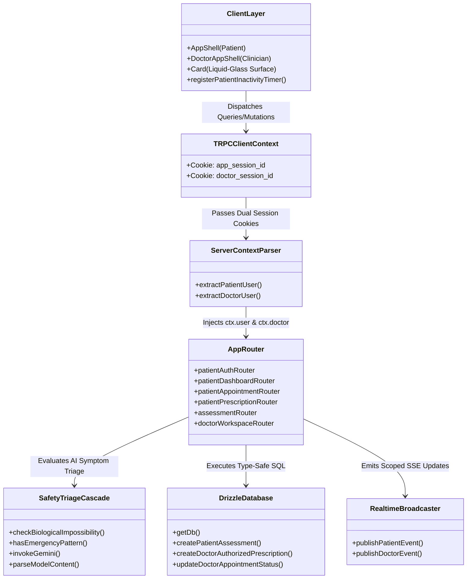
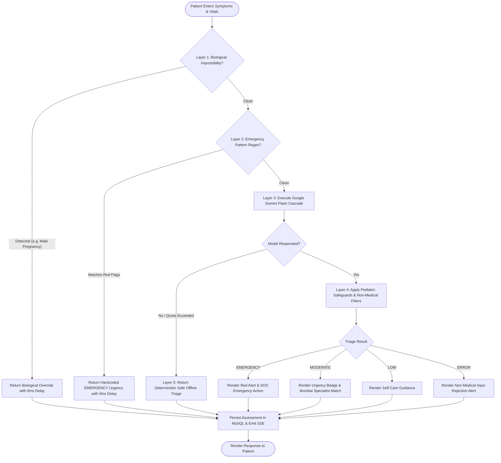
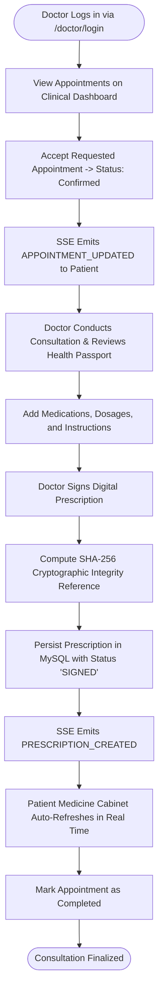
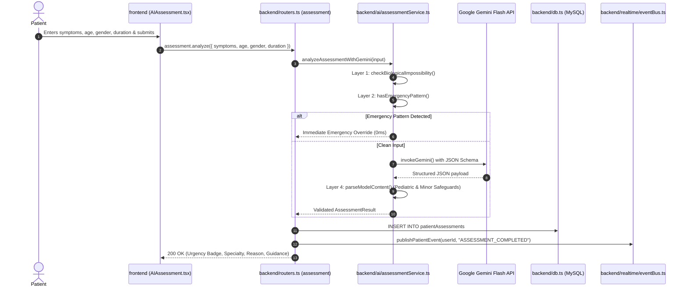
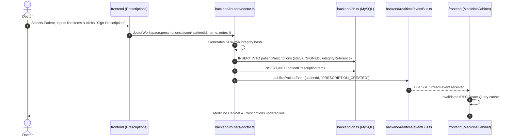

# LifeLink — System Architecture & Technical Diagrams

A comprehensive visual and technical reference illustrating the software architecture, database relations, API structures, activity lifecycles, and sequence workflows for the LifeLink Healthcare Platform.

---

## 1. Project Files & Directory Architecture

```text
LifeLink-Smart-Healthcare-Assistance-Platform/
│
├── 🗄️ DATABASE PERSISTENCE LAYER [Related to: Section 2 ER Diagram]
│   ├── database/schema.ts                 <-- [EDIT] Drizzle MySQL schema (11 relational tables & relations)
│   ├── database/drizzle.config.ts         <-- [READ] Database connection & Drizzle Studio config
│   └── database/migrations/               <-- [AUTO] Versioned SQL migration history
│
├── ⚙️ BACKEND API & SERVICES LAYER [Related to: Section 3 Class & Section 5 Sequence Diagrams]
│   ├── backend/_core/index.ts             <-- [READ] Express entry point, cookie parsers, Vite dev middleware
│   ├── backend/_core/context.ts           <-- [READ] Dual session context parser (app_session_id & doctor_session_id)
│   ├── backend/_core/trpc.ts              <-- [READ] tRPC procedures (publicProcedure, protectedProcedure, doctorProcedure)
│   ├── backend/routers.ts                 <-- [EDIT] Master tRPC appRouter definition
│   ├── backend/routers/
│   │   ├── patient.ts                     <-- [EDIT] Patient APIs (auth, health passport, appointments, medicines)
│   │   └── doctor.ts                      <-- [EDIT] Doctor APIs (queue triage, consultations, digital prescriptions)
│   ├── backend/db.ts                      <-- [EDIT] Type-safe Drizzle SQL queries & relational helpers
│   ├── backend/ai/assessmentService.ts    <-- [EDIT] 5-layer AI symptom triage & Gemini Flash cascade engine
│   ├── backend/realtime/eventBus.ts       <-- [EDIT] Scoped Server-Sent Events (SSE) notification broadcaster
│   ├── backend/storage.ts                 <-- [READ] Cloud S3 / local profile asset storage adapter
│   ├── backend/syntheticDoctor.ts        <-- [READ] 12 Mumbai specialist accounts provisioning helpers
│   └── backend/auth/                      <-- [READ] Native bcrypt hashing, JWT issuance, Google OAuth
│
├── 💻 FRONTEND CLIENT INTERFACE LAYER [Related to: Section 3 Component & Section 4 Activity Diagrams]
│   ├── frontend/src/App.tsx               <-- [EDIT] React Router hierarchy (/patient/*, /doctor/*, /workspace)
│   ├── frontend/src/index.css             <-- [EDIT] Liquid-Glass design tokens, atmospheric mesh, WCAG 2.1 AA rules
│   ├── frontend/src/components/layout/
│   │   ├── AppShell.tsx                   <-- [EDIT] Patient portal navigation, drawer & header shell
│   │   └── DoctorAppShell.tsx             <-- [EDIT] Clinician workspace navigation, drawer & header shell
│   ├── frontend/src/components/ui/
│   │   ├── Card.tsx                       <-- [EDIT] Liquid-Glass surface container primitive
│   │   ├── Button.tsx                     <-- [EDIT] Accessible button primitive
│   │   └── Popup.tsx                      <-- [EDIT] Modal dialog with useId accessibility
│   ├── frontend/src/hooks/
│   │   ├── patientInactivity.ts           <-- [EDIT] 5-minute inactivity session tracking hook
│   │   └── useSSE.ts                      <-- [EDIT] Live Server-Sent Events subscription hook
│   └── frontend/src/features/
│       ├── patient/
│       │   ├── Dashboard.tsx              <-- [EDIT] Aggregated clinical overview
│       │   ├── Assessment/                <-- [EDIT] 5-stage AI Symptom Checker & Triage interface
│       │   ├── Specialists/               <-- [EDIT] Mumbai Specialist Rail Network directory & Leaflet map
│       │   ├── Appointments/              <-- [EDIT] Appointment booking & consultation history
│       │   ├── HealthPassport/            <-- [EDIT] Medical passport, chronic conditions, emergency contacts
│       │   └── Medicines/                 <-- [EDIT] Medicine cabinet & schedule tracker
│       ├── doctor/
│       │   ├── Dashboard.tsx              <-- [EDIT] Doctor appointments queue & clinical statistics
│       │   ├── Setup.tsx                  <-- [EDIT] Specialist onboarding & consultation schedule
│       │   ├── Login.tsx                  <-- [EDIT] Clinician credential authentication (split layout)
│       │   ├── ResetPassword.tsx          <-- [EDIT] Clinician password recovery workflow (split layout)
│       │   ├── Patients/                  <-- [EDIT] Patient roster & medical history view
│       │   ├── Consultations/             <-- [EDIT] Clinical consultation & notes workspace
│       │   └── Prescriptions/             <-- [EDIT] Digital prescription authoring & SHA-256 signer
│       └── entry/
│           ├── Login.tsx                  <-- [EDIT] Patient login (credentials & Google OAuth, split layout)
│           ├── Register.tsx               <-- [EDIT] Patient registration (credentials & Google OAuth, split layout)
│           └── WorkspaceSelector.tsx      <-- [EDIT] Portal chooser (Patient vs Doctor Workspace)

│
├── 🌐 ISOMORPHIC SHARED DOMAIN LAYER
│   ├── shared/biologicalValidation.ts     <-- [READ] Deterministic biological consistency rules
│   ├── shared/const.ts                    <-- [READ] Cookie tokens, session timeouts, role enums
│   ├── shared/mumbaiRailNetwork.ts        <-- [READ] Mumbai Suburban rail stations & corridors
│   └── shared/types.ts                    <-- [READ] Cross-boundary TypeScript schemas & contracts
│
└── 🛠️ RUNTIME & SETUP SCRIPTS
    ├── scripts/init-db.ts                 <-- [RUN] Idempotently provisions 'lifelink' database in MySQL
    ├── scripts/seed-doctors.ts            <-- [RUN] Seeds 12 Mumbai specialist work accounts
    ├── scripts/sync-doctors.ts            <-- [RUN] Audits & synchronizes 12 doctor accounts in MySQL
    ├── scripts/clear-users.ts             <-- [RUN] Atomically wipes all user records and history
    └── scripts/dev.mjs                    <-- [RUN] Development runtime orchestrator (Vite on 5173, Express on 4000 with fallbacks)
```

---

## 2. Entity-Relationship (ER) Diagram

### Visual Relational Hierarchy
```text
users (Central Identity & Role Registry)
│
├── 1 : 1 ──> patientCredentials (email, passwordHash)
├── 1 : 1 ──> syntheticDoctorCredentials (doctorId, email, passwordHash)
├── 1 : N ──> patientProviderIdentities (OAuth provider, providerUserId)
├── 1 : 1 ──> patientProfiles (bloodGroup, phone, allergiesJson, conditionsJson)
│
├── 1 : N ──> patientAssessments (symptoms, duration, urgency: LOW/MODERATE/EMERGENCY/ERROR, specialty)
├── 1 : N ──> patientAppointments (doctorId, scheduledAt, status: Requested/Confirmed/Completed/Cancelled)
├── 1 : N ──> patientMedicines (name, dosage, frequency, schedule, quantity)
├── 1 : N ──> patientEmergencyContacts (name, relationship, phone)
├── 1 : N ──> patientEvents (type: APPOINTMENT_UPDATED, ASSESSMENT_COMPLETED, PRESCRIPTION_CREATED)
│
└── 1 : N ──> patientPrescriptions (doctorId, status: UNSIGNED/SIGNED, integrityReference)
              │
              └── 1 : N ──> patientPrescriptionItems (name, dosage, instructions)
```

### Complete Mermaid ER Diagram


---

## 3. Dual-Session Architecture & Class Diagram



---

## 4. Activity Workflows

### A. 5-Layer Clinical AI Symptom Triage


### B. Doctor Consultation & Cryptographic Prescription Signing


### C. 5-Minute Inactivity Session Termination
```mermaid
flowchart TD
    UserActive([User Interacts with Portal]) --> StartTimer[Start 5-Minute Timer (300,000 ms)]
    StartTimer --> ActivityDetected{User Event: mouse/key/touch/scroll?}
    ActivityDetected -- Yes --> StartTimer
    ActivityDetected -- No Activity for 5 Mins --> TriggerExpire[Trigger Session Timeout Handler]
    TriggerExpire --> InvalidateSession[Clear Session Cookies via /api/trpc/auth.logout]
    InvalidateSession --> ShowToast[Display Inactivity Toast Notification]
    ShowToast --> RedirectLogin[Redirect to /login with Replace History]
```

---

## 5. Sequence Diagrams

### A. AI Symptom Evaluation Sequence


### B. Prescription Issuance & Real-Time Sync Sequence


---

## 6. How to Run & Verify from Scratch

```powershell
# 1. Start MySQL 8 Service
net start MySQL80

# 2. Idempotently Create Database
npx tsx scripts/init-db.ts

# 3. Apply Drizzle Schema Migrations
npm run db:push

# 4. Seed Default Mumbai Specialists & Reset Test Data
npx tsx scripts/seed-doctors.ts

# 5. Start Full-Stack Development Server
npm run dev

# 6. Execute Full Verification Pipeline
npm run verify
```
