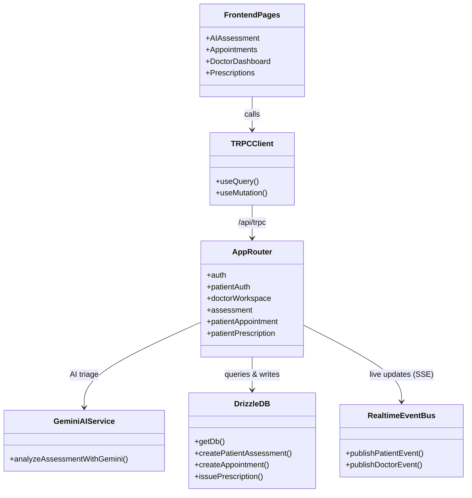
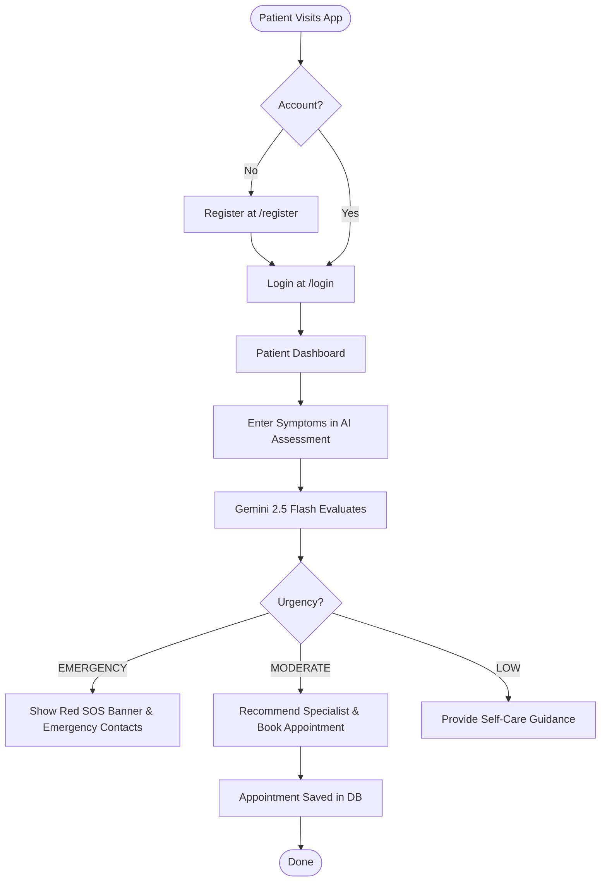
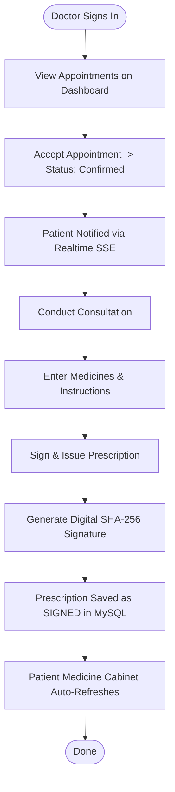
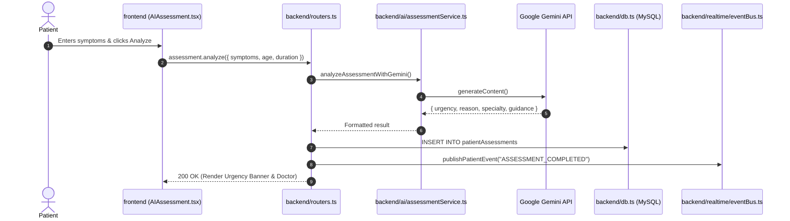
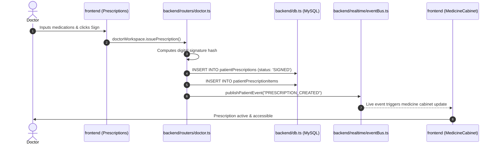

# LifeLink — System Architecture & Diagrams

A clean visual guide for the team showing how files, database tables, and application workflows connect.

---

## 1. Project Files & Diagrams Tree

```
LifeLink-Platform/
│
├── 🗄️ DATABASE LAYER [Related to: ER Diagram]
│   ├── database/schema.ts                 <-- [EDIT] Tables, fields, foreign keys & relationships
│   ├── database/drizzle.config.ts         <-- [READ] DB connection & migration configs
│   └── database/migrations/               <-- [AUTO] Generated SQL schema migration history
│
├── ⚙️ BACKEND API LAYER [Related to: Class & Sequence Diagrams]
│   ├── backend/_core/index.ts             <-- [READ] Express server entry point & middleware
│   ├── backend/routers.ts                 <-- [EDIT] Master tRPC router (appRouter)
│   ├── backend/routers/
│   │   ├── patient.ts                     <-- [EDIT] Patient APIs (appointments, profile, medicines)
│   │   └── doctor.ts                      <-- [EDIT] Doctor APIs (consultations, prescriptions)
│   ├── backend/db.ts                      <-- [EDIT] SQL queries & helpers using Drizzle ORM
│   ├── backend/ai/assessmentService.ts    <-- [EDIT] Google Gemini 2.5 Flash symptom triage logic
│   ├── backend/realtime/eventBus.ts       <-- [EDIT] Live Server-Sent Events (SSE) broadcaster
│   └── backend/auth/                      <-- [READ] Password hashing & JWT session authentication
│
├── 💻 FRONTEND CLIENT LAYER [Related to: Class & Activity Diagrams]
│   ├── frontend/src/App.tsx               <-- [EDIT] React router paths (/patient/*, /doctor/*)
│   ├── frontend/src/components/layout/
│   │   ├── AppShell.tsx                   <-- [EDIT] Patient navigation & sidebar shell
│   │   └── DoctorAppShell.tsx             <-- [EDIT] Doctor workspace sidebar shell
│   └── frontend/src/features/
│       ├── patient/
│       │   ├── Dashboard.tsx              <-- [EDIT] Patient dashboard overview
│       │   ├── Assessment/                <-- [EDIT] AI Symptom Checker & triage UI
│       │   ├── Specialists/               <-- [EDIT] Doctor directory & Mumbai rail locator
│       │   ├── Appointments/              <-- [EDIT] Booking slots & appointment list
│       │   ├── HealthPassport/            <-- [EDIT] Medical passport & emergency contacts
│       │   └── Medicines/                 <-- [EDIT] Medicine cabinet & schedule tracker
│       ├── doctor/
│       │   ├── Dashboard.tsx              <-- [EDIT] Doctor queue & realtime triage alerts
│       │   ├── Patients/                  <-- [EDIT] Patient medical history & records
│       │   ├── Consultations/             <-- [EDIT] Clinical consultation session view
│       │   └── Prescriptions/             <-- [EDIT] Digital prescription creator & signer
│       └── entry/
│           ├── Login.tsx                  <-- [EDIT] Patient login
│           ├── Register.tsx               <-- [EDIT] Patient registration
│           └── WorkspaceSelector.tsx      <-- [EDIT] Portal chooser (Patient vs Doctor)
│
└── 🛠️ RUNTIME & SETUP SCRIPTS
    ├── scripts/init-db.ts                 <-- [RUN] Auto-creates 'lifelink' database in MySQL
    ├── scripts/seed-doctors.ts            <-- [RUN] Resets & seeds mock doctors & test patients
    └── scripts/dev.mjs                    <-- [RUN] Unified dev server runner (Express + Vite)
```

---

## 2. Entity-Relationship (ER) Diagram

### Visual ER Tree
```
users (Central Auth & User Identity)
│
├── 1 : 1 ──> patientCredentials (email, passwordHash)
├── 1 : 1 ──> syntheticDoctorCredentials (doctorId, email, passwordHash)
├── 1 : 1 ──> patientProfiles (bloodGroup, phone, allergiesJson, conditionsJson)
│
├── 1 : N ──> patientAssessments (symptoms, duration, urgency: LOW/MODERATE/EMERGENCY, specialty)
├── 1 : N ──> patientAppointments (doctorId, scheduledAt, status: Requested/Confirmed/Completed)
├── 1 : N ──> patientMedicines (name, dosage, frequency, schedule, quantity)
├── 1 : N ──> patientEmergencyContacts (name, relationship, phone)
├── 1 : N ──> patientEvents (type: APPOINTMENT_UPDATED, ASSESSMENT_COMPLETED, etc.)
│
└── 1 : N ──> patientPrescriptions (doctorId, status: UNSIGNED/SIGNED, integrityReference)
              │
              └── 1 : N ──> patientPrescriptionItems (name, dosage, instructions)
```

### Full Mermaid ER Diagram


---

## 3. Class & Component Architecture Diagram



---

## 4. Activity Workflows

### A. Patient Onboarding & AI Triage


### B. Doctor Consultation & Prescription Signing


---

## 5. Sequence Diagrams

### A. AI Symptom Triage Sequence


### B. Prescription Signing Sequence


---

## 6. How to Run from Scratch

```powershell
# 1. Start MySQL
net start MySQL80

# 2. Create database
npx tsx scripts/init-db.ts

# 3. Create tables
npm run db:push

# 4. Seed sample data
npx tsx scripts/seed-doctors.ts

# 5. Start dev server
npm run dev
```
